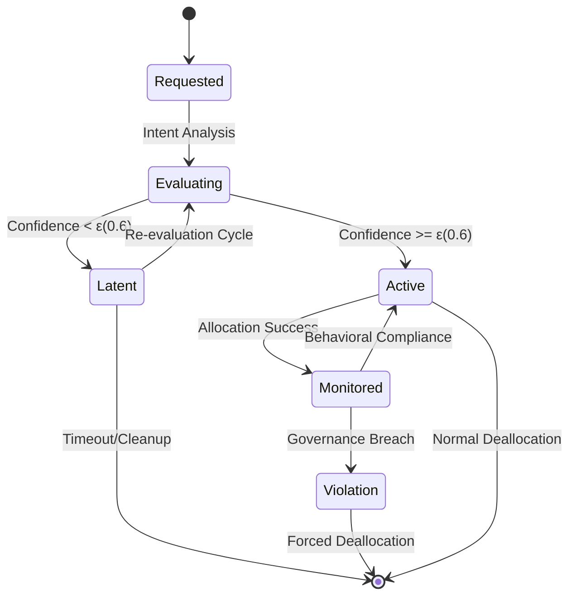
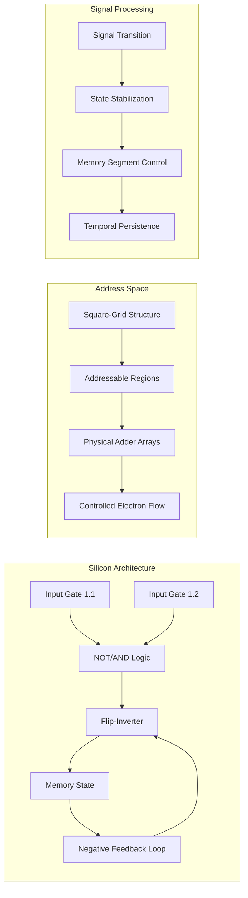
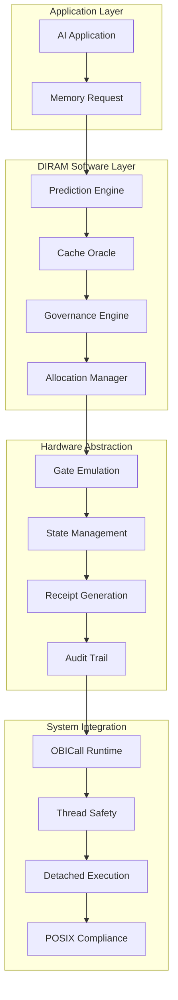
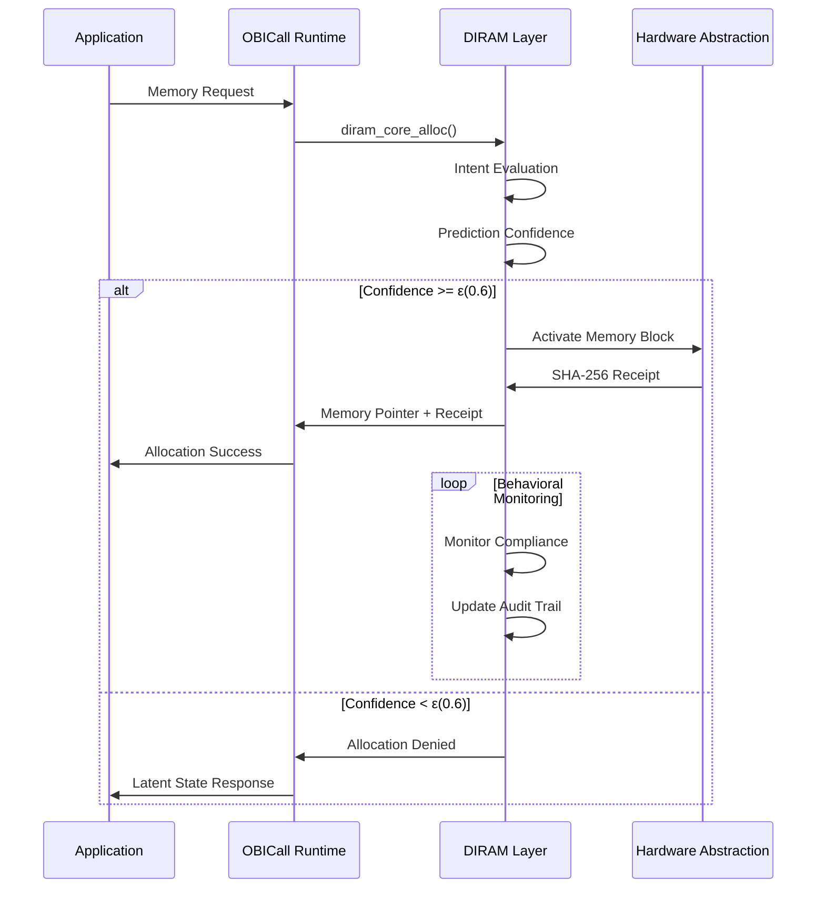

# DIRAM (Directed Instruction RAM) Technical Specification

## Executive Summary

DIRAM represents a fundamental shift from passive memory allocation to active, predictive memory management. This specification outlines the technical implementation of traceable, fluid, and gate-driven memory architecture designed for sovereign AI systems.

## Core Architecture Principles

### 1. Traceable Memory Behavior

DIRAM treats memory as an active participant in system operations rather than passive storage. Every allocation generates cryptographic verification and undergoes behavioral evaluation.

```mermaid
graph TD
    A[Memory Allocation Request] --> B[Intent Evaluation]
    B --> C[PID Locality Check]
    C --> D[Prediction Confidence Score]
    D --> E{Confidence >= ε(0.6)?}
    E -->|Yes| F[Generate SHA-256 Receipt]
    E -->|No| G[Allocation Denied]
    F --> H[Memory Block Activated]
    H --> I[Behavioral Monitoring]
    I --> J[Audit Trail Update]
    G --> K[Cache Miss Logged]
```

**Key Components:**
- **SHA-256 Receipt Generation**: Cryptographic verification for every allocation
- **PID Locality Scoring**: Process-bound memory proximity evaluation
- **Intent-Based Evaluation**: Memory must justify its existence through behavioral utility
- **Continuous Monitoring**: Active tracking of memory block behavior patterns

### 2. Fluid Memory Management

Memory exists in temporary, cache-reactive segments where allocation is conditional on predictive confidence exceeding the Sinphasé threshold.



**Memory States:**
- **Requested**: Initial allocation request submitted
- **Evaluating**: Prediction confidence scoring in progress
- **Latent**: Below-threshold confidence, memory held in suspended state
- **Active**: Above-threshold confidence, memory allocated and operational
- **Monitored**: Continuous behavioral compliance checking
- **Violation**: Governance constraint breach detected

**Governance Constraints:**
- Maximum 3 heap events per epoch
- Prediction confidence threshold ε(x) ≤ 0.6
- Zero-trust boundary enforcement
- Dynamic rollback capability on governance failure

### 3. Gate-Driven Memory Design

At the silicon level, DIRAM implements a dual-gate input, single-output flip-inverter model for controlled memory state management.



**Hardware Implementation:**
- **Dual-Gate Input**: Gates 1.1 and 1.2 handle signal transition via NOT/AND logic
- **Flip-Inverter**: Inversion and negative feedback stabilize temporary memory segments
- **Square-Grid Memory**: Controlled electron flow enables addressable behavior
- **Physical Adder Arrays**: Structured addressing for memory region management

## Technical Implementation Architecture

### Software Emulation Layer



### Core API Interface

```c
// DIRAM Core Allocation Function
void* diram_core_alloc(size_t size, pid_t pid, const char* tag) {
    // Intent evaluation and prediction confidence scoring
    prediction_result_t prediction = evaluate_allocation_intent(size, pid, tag);
    
    if (prediction.confidence >= SINPHASE_THRESHOLD) {
        // Generate cryptographic receipt
        char receipt[65];
        generate_sha256_receipt(size, pid, tag, receipt);
        
        // Activate memory block with behavioral monitoring
        return activate_memory_block(size, pid, tag, receipt);
    }
    
    // Allocation denied - maintain in latent state
    return NULL;
}

// Behavioral monitoring and governance enforcement
int diram_monitor_behavior(void* ptr, behavior_metrics_t* metrics) {
    if (metrics->heap_events > MAX_HEAP_EVENTS_PER_EPOCH) {
        // Governance violation detected
        return enforce_governance_rollback(ptr);
    }
    
    return update_behavioral_audit_trail(ptr, metrics);
}
```

## Integration with OBINexus Ecosystem

### OBICall Runtime Integration



### Thread Safety and Detached Execution

- **POSIX Thread Safety**: Fork-safe execution with process isolation
- **Detached Mode**: Independent memory management for compute-heavy environments
- **Lookahead Computation**: Speculative memory promises for predictive allocation
- **Isolation Boundaries**: Zero-trust memory sovereignty enforcement

## Performance Characteristics

### Optimization Targets

- **Allocation Overhead**: O(1) with cryptographic receipt generation
- **Prediction Latency**: Sub-microsecond confidence scoring
- **Memory Overhead**: ~128 bytes per allocation for metadata and audit trail
- **Governance Checking**: Constant-time constraint validation

### Metrics Collection

```c
typedef struct {
    uint64_t cache_hits;
    uint64_t cache_misses;
    uint64_t prediction_accuracy;
    uint64_t governance_violations;
    double average_confidence_score;
} diram_metrics_t;
```

## Development Roadmap

### Phase 1: Software Emulation (Current)
- Complete prediction engine implementation
- Behavioral monitoring system
- Cryptographic receipt generation
- Basic governance constraint enforcement

### Phase 2: Hardware Integration
- FPGA prototyping of gate-driven architecture
- Silicon emulation of dual-gate input system
- Performance validation against software emulation

### Phase 3: Production Deployment
- Integration with OBICall runtime
- Comprehensive testing in AI workload scenarios
- Performance optimization and scaling validation

### Phase 4: Advanced Features
- Bayesian governance for speculative memory access
- Immutable receipt chain (Merkle-linked allocations)
- Tactile REPL debugger for interactive silicon emulation

## Compliance and Governance

### Sinphasé Protocol Adherence
- Entropy constraint enforcement: ε(x) ≤ 0.6
- Maximum heap events per epoch: 3
- Dynamic rollback on governance failure
- Zero-trust boundary maintenance

### Audit and Traceability
- SHA-256 cryptographic receipts for all operations
- Comprehensive behavioral audit trails
- Immutable logging for compliance verification
- Real-time governance monitoring

---

**Memory is not a vessel. It is a terrain. And terrain must be defended.**

*OBIAI Systems Directive 1*