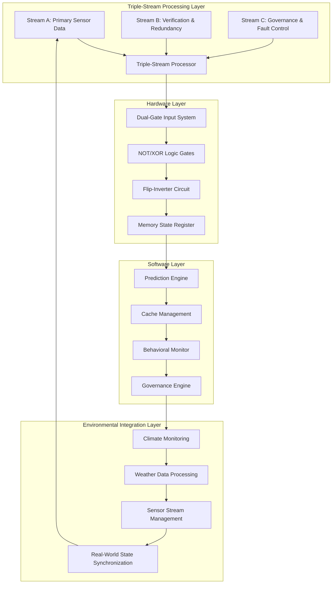
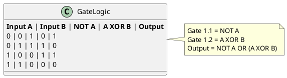
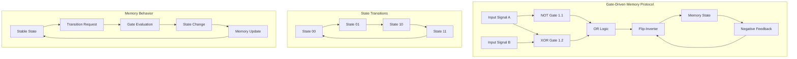
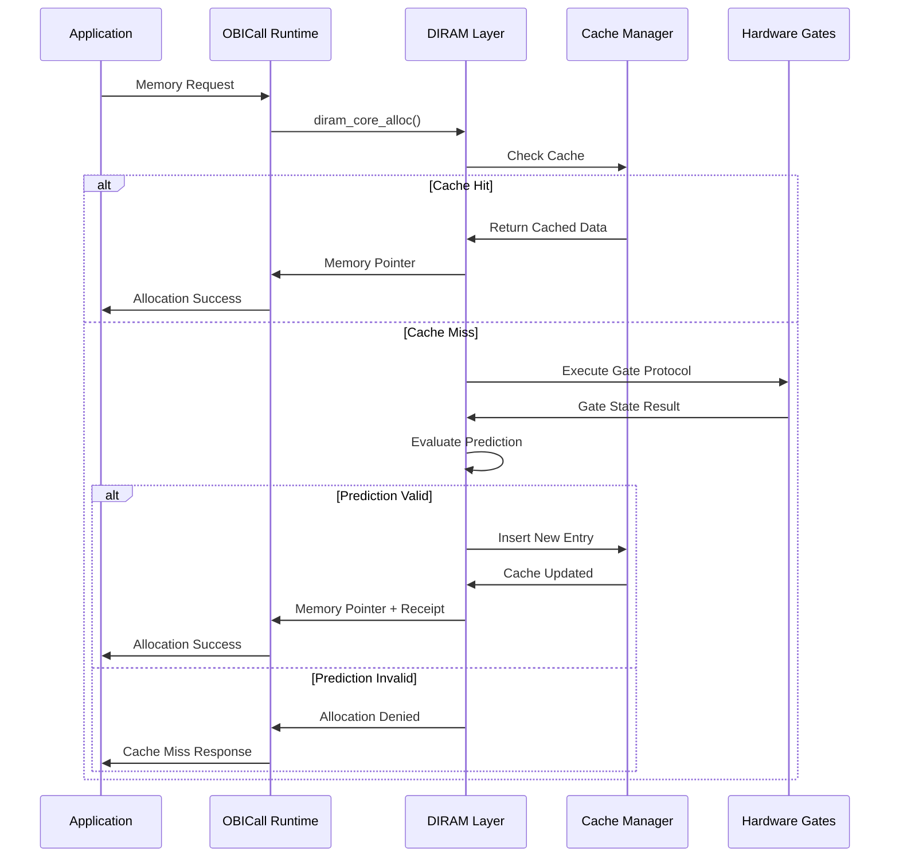

# DIRAM (Directed Instruction RAM)

[](https://github.com/obinexus)
[](LICENSE)
[](https://github.com/obinexus/diram)

DIRAM is a predictive, cache-reactive memory architecture implementing gate-driven silicon logic with triple-stream behavioral monitoring for sovereign AI systems. Part of the OBINexus Aegis Project, DIRAM provides cryptographically-enforced memory allocation with zero-trust governance integration through real-world environmental monitoring capabilities.

## 🧠 DIRAM Triple-Stream Architecture Overview

**DIRAM (Directed Instruction RAM)** implements a fault-tolerant memory substrate through three core architectural principles enhanced with triple-stream processing for real-world environmental monitoring:



## Core Architectural Principles

### 1. Traceable Memory Behavior

Memory operates as an active participant requiring intent-based justification for allocation. Every memory operation generates cryptographic verification and undergoes behavioral evaluation.

```mermaid
graph TD
    A[Memory Allocation Request] --> B[Intent Evaluation]
    B --> C[PID Locality Check]
    C --> D[Prediction Confidence Score]
    D --> E{Confidence >= ε(0.6)?}
    E -->|Yes| F[Generate SHA-256 Receipt]
    E -->|No| G[Allocation Denied]
    F --> H[Memory Block Activated]
    H --> I[Behavioral Monitoring]
    I --> J[Audit Trail Update]
    G --> K[Cache Miss Logged]
```

**Technical Implementation:**
- SHA-256 cryptographic receipt generation per allocation
- PID locality scoring for process-bound memory proximity
- Intent-based evaluation requiring behavioral utility justification
- Continuous behavioral monitoring with audit trail maintenance

### 2. Cache-Reactive Memory Management

DIRAM implements advanced predictive prefetching with pre/post computation layers, enabling cache-reactive allocation based on behavioral pattern analysis and OBINexus governance compliance.

```mermaid
graph LR
    subgraph "Pre-Computation Layer"
        A[Memory Request] --> B[Access Pattern Analysis]
        B --> C[OBINexus Compliance Check]
        C --> D[Prediction Confidence Scoring]
    end
    
    subgraph "Cache Decision Engine"
        D --> E{Cache Hit Probable?}
        E -->|Hit| F[Execute Hit Strategy]
        E -->|Miss| G[Execute Miss Mitigation]
        F --> H[Lookahead Prefetch]
        G --> I[Speculative Allocation]
    end
    
    subgraph "Post-Computation Layer"
        H --> J[Update Behavioral Patterns]
        I --> J
        J --> K[Governance Audit Update]
        K --> L[Performance Metrics Update]
    end
    
    subgraph "Hardware Cache Integration"
        M[L1 Cache] --> N[L2 Cache]
        N --> O[DIRAM Memory]
        O --> P[Behavioral Audit]
        L --> M
    end
```



**Predictive Prefetching Architecture:**

```mermaid
graph TD
    subgraph "Decord Policy Framework"
        A[Allocation Request] --> B[Compliance Validation]
        B --> C[Access Pattern Analysis]
        C --> D[Prediction Generation]
    end
    
    subgraph "Cache Hit Optimization"
        E[Hit Confidence >= Threshold] --> F[Lookahead Prefetch]
        F --> G[Subsequent Allocation Prediction]
        G --> H[Behavioral Pattern Learning]
    end
    
    subgraph "Cache Miss Mitigation"
        I[Miss Penalty >= Threshold] --> J[Speculative Allocation]
        J --> K[Sinphasé Constraint Validation]
        K --> L[Miss Mitigation Metrics Update]
    end
    
    D --> E
    D --> I
    H --> M[Performance Optimization]
    L --> M
```



**Cache Implementation Features:**
- **LRU Optimization**: Least Recently Used eviction with behavioral analysis
- **Hit/Miss Tracking**: Comprehensive cache performance metrics
- **Hardware Coordination**: L1/L2 cache integration with software layer
- **Predictive Prefetching**: Lookahead allocation with pre/post computation layers, decord policy compliance, and cache hit/miss mitigation strategies
- **Access Pattern Analysis**: Behavioral pattern learning with speculative allocation management
- **OBINexus Compliance**: Sinphasé governance integration with zero-trust boundary validation

### 3. Gate-Driven Silicon Logic

Hardware implementation through dual-gate input system with NOT/XOR logic processing and flip-inverter state management.



**Gate Protocol Architecture:**



## Features

- **Cryptographic Memory Tracing**: SHA-256 receipts for all allocations
- **Cache-Reactive Allocation**: LRU optimization with predictive confidence scoring
- **Gate-Driven Hardware Logic**: NOT/XOR gate protocol with flip-inverter state management
- **Heap Constraint Enforcement**: Sinphasé governance with ε(x) ≤ 0.6 constraint
- **Zero-Trust Memory Boundaries**: Cryptographically enforced isolation
- **Detached Daemon Mode**: Background operation with comprehensive logging
- **Hardware-Software Portability**: Unified cache management across abstraction layers
- **REPL Interface**: Interactive memory allocation and gate state inspection

## Installation

### Prerequisites

- GCC or compatible C compiler
- POSIX-compliant system (Linux, macOS, BSD)
- GNU Make
- pthread support
- Hardware simulation libraries (for gate emulation)

### Building from Source

```bash
git clone https://github.com/obinexus/diram.git
cd diram
make clean
make
```

### Installation

```bash
# System-wide installation (requires privileges)
sudo make install

# Custom prefix installation
make install PREFIX=$HOME/.local
```

## Configuration

DIRAM uses hierarchical configuration supporting cache optimization and gate protocol parameters:

```ini
# ~/.dramrc or project-local .dramrc
# Basic Configuration
memory_limit=2048       # Memory limit in MB
memory_space=production # Named memory space
trace=true              # Enable allocation tracing
log_dir=logs           # Log directory path

# Cache Configuration
cache_size=1024         # LRU cache size in MB
hit_threshold=0.8       # Cache hit confidence threshold
prefetch_enable=true    # Enable predictive prefetching
lru_aging_factor=0.95   # LRU aging coefficient

# Predictive Prefetching Configuration
lookahead_window_size=256      # Lookahead prediction window (KB)
prediction_confidence_min=0.75 # Minimum prediction confidence threshold
speculative_alloc_limit=64     # Maximum speculative allocations per process
decord_policy_level=balanced   # Conservative, balanced, or aggressive
pre_compute_timeout_ms=100     # Pre-computation phase timeout
post_compute_async=true        # Enable asynchronous post-computation

# Cache Hit/Miss Mitigation
hit_optimization_enable=true   # Enable cache hit optimization strategies
miss_penalty_threshold=10.0    # Miss penalty threshold (microseconds)
pattern_learning_rate=0.85     # Behavioral pattern learning coefficient
compliance_strict_mode=true    # Enforce strict OBINexus compliance

# Gate Protocol Configuration
gate_simulation=true    # Enable hardware gate emulation
gate_delay_ns=50        # Gate propagation delay (nanoseconds)
flip_inverter_stable=true # Flip-inverter stabilization
negative_feedback=true  # Enable negative feedback loop

# Heap constraint configuration
max_heap_events=3       # Maximum allocations per epoch
epsilon_threshold=0.6   # Sinphasé governance threshold

# Hardware Integration
hardware_acceleration=false # Enable hardware-specific optimizations
fpga_target=false           # Target FPGA implementation
silicon_emulation=true      # Software silicon emulation
```

## Usage

### Basic Commands

```bash
# Initialize DIRAM with cache optimization
diram --init --cache-size=2048

# Run with gate protocol tracing
diram --trace --gate-debug

# Start interactive REPL with hardware emulation
diram --repl --hardware-sim

# Run in detached daemon mode with full logging
diram --detach -c production.drc --trace --cache-stats
```

### REPL Commands

```
Commands:
  alloc <size> <tag>                    Allocate memory with triple-stream processing
  free <addr>                           Free allocated memory and update streams
  triple-stream-status                  Display current triple-stream buffer states
  environmental-monitor                 Show real-time environmental sensor readings
  nil-encoding-stats                    Display NIL-encoding instruction statistics
  fault-assessment                      Show current environmental fault levels
  stream-sync <stream_id>               Force synchronization of specific stream
  wait-state-timeout <ms>               Configure triple-stream timeout period
  bitflip-encoding <data>               Test OBINexus bit-flip standard encoding
  topology-recovery                     Display distributed topology recovery status
  panic-isolation-test                  Simulate panic isolation protocol
  cache-stats                           Display cache hit/miss with stream correlation
  prefetch-stats                        Show predictive prefetching with environmental data
  pattern-analysis <pid>                Display behavioral patterns with sensor correlation
  decord-policy <level>                 Set decord policy level for triple-stream processing
  gate-state                            Show current gate protocol state with stream data
  compliance-check <pid>                Validate OBINexus compliance including environmental
  lru-list                              Display LRU cache with triple-stream indicators
  speculative-allocs                    Show active speculative allocations
  behavioral-patterns                   Display learned patterns with environmental triggers
  governance-metrics                    Show Sinphasé governance with fault-tolerance metrics
  sensor-calibration                    Calibrate environmental sensor readings
  stream-buffer-dump                    Debug dump of all three stream buffers
  trace                                 Show allocation trace with environmental correlation
  hardware-sim                          Toggle hardware simulation with sensor integration
  config                                Show current configuration including environmental
  exit/quit                             Exit REPL
```

### Example REPL Session

```
$ diram --repl --trace --hardware-sim --environmental-monitor
DIRAM REPL v3.0.0 (Triple-Stream Environmental Monitoring Mode)
Type 'help' for commands, 'exit' to quit

diram> environmental-monitor
Environmental Sensor Readings:
  Temperature: 23.4°C (Normal - Warning Level)
  Humidity: 45.2% RH (Optimal)
  Pressure: 1013.2 hPa (Standard)
  Fault Assessment: WARNING_LEVEL
  Topology Impact: MINIMAL

diram> alloc 1024 climate_buffer
Triple-Stream Processing: Initializing...
Stream A: [01 10 11] - Primary instruction received
Stream B: [11 01 10] - Verification data complete
Stream C: [10 11 01] - Governance control active
Wait State: COMPLETE (all streams synchronized)
NIL-Encoding: 0b01 (Recovery Operation detected)
Environmental Correlation: Temperature stable, proceeding
Allocated 1024 bytes at 0x7f8a2c001000 (SHA: 3d4f2c8a9b6e1f...)
Triple-Stream Buffer: Updated (1 complete instruction set)

diram> fault-assessment
Current Environmental Fault Assessment:
  Primary Fault Level: WARNING_LEVEL (0-3 range)
  Temperature Trend: STABLE (+0.1°C/min)
  Pressure Differential: NOMINAL (±0.5 hPa)
  Humidity Stability: EXCELLENT (±1% variation)
  Recommended Action: CONTINUE_NORMAL_OPERATION
  Next Assessment: 30 seconds

diram> triple-stream-status
Triple-Stream Buffer Status:
  Stream A (Primary): [01 10 11] - COMPLETE
  Stream B (Verification): [11 01 10] - COMPLETE  
  Stream C (Governance): [10 11 01] - COMPLETE
  Wait State: SYNCHRONIZED
  Timeout Counter: 0ms (not waiting)
  Last Instruction: RECOVERY_OPERATION
  Environmental Sync: ACTIVE
  Fault Correlation: ENVIRONMENTAL_NORMAL

diram> nil-encoding-stats
NIL-Encoding Protocol Statistics:
  Total Instructions Processed: 156
  NIL Operations (0b00): 23 (14.7%)
  Recovery Operations (0b01): 89 (57.1%)
  Audit Operations (0b10): 31 (19.9%)
  Panic Isolations (0b11): 13 (8.3%)
  Environmental Triggers: 67 (42.9%)
  Fault-Tolerance Activations: 102 (65.4%)

diram> stream-sync A
Synchronizing Stream A (Primary Instructions)...
Current Buffer: [01 10 11]
Pending Bits: 0
Synchronization: COMPLETE
Environmental Correlation: VERIFIED
Next Expected Bit Window: 100ms

diram> bitflip-encoding "temperature:25.3"
OBINexus Bit-Flip Standard Encoding:
Input: "temperature:25.3"
Sensor Value: 25.3°C
Bit Pattern: [01 10 11 00 10 01 11 10 01 00 11 01]
Stream Distribution:
  Stream A: [01 10 11 00] - Primary sensor data
  Stream B: [10 01 11 10] - Verification checksum
  Stream C: [01 00 11 01] - Environmental governance
Encoding Status: SUCCESSFUL
Environmental Integration: READY

diram> topology-recovery
Distributed Topology Recovery Status:
  P2P Network: 4/4 nodes OPERATIONAL
  Bus Topology: ACTIVE (no faults detected)
  Star Configuration: Hub STABLE, 8/8 peripherals connected
  Ring Network: TOKEN_PASSING_NORMAL, latency 12ms
  Fault Recovery Protocols: STANDBY
  Environmental Monitoring Integration: ACTIVE
  Triple-Stream Coordination: SYNCHRONIZED
  Last Recovery Event: 2 hours ago (RESOLVED)
```

## Technical Implementation

### Core API Interface

```c
// DIRAM Triple-Stream Processing with Environmental Integration
typedef struct {
    uint8_t stream_a[3];     // Primary instruction stream
    uint8_t stream_b[3];     // Secondary verification stream  
    uint8_t stream_c[3];     // Control/governance stream
    uint8_t wait_state;      // Bit arrival synchronization
    uint64_t timeout_ns;     // Maximum wait period
    sensor_reading_t climate_data;  // Environmental sensor integration
} triple_stream_buffer_t;

// Triple-Stream Memory Allocation with Environmental Monitoring
void* diram_triple_stream_alloc(size_t size, pid_t pid, const char* tag) {
    // Initialize triple-stream buffer
    triple_stream_buffer_t buffer = {0};
    initialize_environmental_monitoring(&buffer);
    
    // Process environmental data through OBINexus bit-flip encoding
    environmental_data_packet_t env_packet = collect_sensor_readings();
    convert_environmental_to_bitstream(&env_packet, &buffer);
    
    // Non-deterministic state processing
    state_transition_result_t result = process_triple_streams(&buffer);
    
    if (result.state == STREAMS_COMPLETE) {
        // Decode instruction triplets using NIL-encoding protocol
        instruction_result_t instruction = decode_triple_instruction(
            buffer.stream_a[0], buffer.stream_b[0], buffer.stream_c[0]
        );
        
        switch (instruction.action) {
            case NO_OPERATION:
                return NULL;  // NIL encoding - no memory operation
            case RECOVERY_OPERATION:
                return execute_fault_recovery_allocation(size, pid, tag);
            case AUDIT_OPERATION:
                return execute_audited_allocation(size, pid, tag);
            case PANIC_ISOLATION:
                return execute_panic_isolation_protocol(size, pid, tag);
        }
    }
    
    // Wait state - insufficient bit patterns received
    return wait_for_complete_triplet_streams(&buffer, size, pid, tag);
}

// Environmental Data Stream Processing
monitoring_result_t process_environmental_stream(
    environmental_data_packet_t* packet,
    triple_stream_buffer_t* buffer
) {
    // Convert sensor readings to OBINexus bit-flip patterns
    uint8_t* encoded_stream = apply_obinexus_bitflip_encoding(
        packet->bit_flip_pattern
    );
    
    // Distribute bits across three streams based on fault-tolerance topology
    for (int i = 0; i < 32; i++) {
        stream_identifier_t stream_id = determine_stream_assignment(i);
        
        state_transition_result_t result = diram_triple_state_transition(
            buffer, encoded_stream[i], stream_id
        );
        
        // Handle fault-tolerant operations per distributed systems framework
        if (result.fault_level >= CRITICAL_THRESHOLD) {
            return initiate_topology_specific_recovery(result);
        }
    }
    
    return (monitoring_result_t){
        .status = ENVIRONMENTAL_MONITORING_ACTIVE,
        .fault_tolerance_verified = true,
        .real_time_constraints_met = true
    };
}

// NIL-Encoding Instruction Decoder
instruction_result_t decode_triple_instruction(
    uint8_t triplet_a, uint8_t triplet_b, uint8_t triplet_c
) {
    // Extract NIL-encoding from leading bit patterns
    diram_instruction_encoding_t instruction_type = 
        extract_nil_encoding(triplet_a);
    
    switch (instruction_type) {
        case DIRAM_NIL:          // 0b00 - No operation
            return (instruction_result_t){
                .action = NO_OPERATION,
                .memory_effect = PRESERVE_STATE,
                .audit_required = false
            };
            
        case DIRAM_RECOVERY:     // 0b01 - Topology recovery
            return execute_distributed_topology_recovery(triplet_b, triplet_c);
            
        case DIRAM_AUDIT:        // 0b10 - Audit trail
            return generate_cryptographic_audit_trail(triplet_b, triplet_c);
            
        case DIRAM_PANIC:        // 0b11 - Isolation protocol
            return initiate_fault_isolation_procedure(triplet_b, triplet_c);
    }
}

// Real-World Sensor Integration
typedef struct {
    float temperature;       // Climate monitoring (°C)
    float humidity;         // Weather data (% RH)
    float pressure;         // Atmospheric pressure (hPa)
    uint64_t timestamp;     // Temporal synchronization
    uint8_t fault_level;    // Environmental fault assessment
} sensor_reading_t;

// Environmental Fault Assessment Integration
fault_assessment_t assess_environmental_conditions(sensor_reading_t* reading) {
    fault_assessment_t assessment = {0};
    
    // Temperature fault levels per OBINexus monitoring standards
    if (reading->temperature < -10.0 || reading->temperature > 60.0) {
        assessment.fault_level = PANIC_ISOLATION;  // Extreme conditions
    } else if (reading->temperature < 0.0 || reading->temperature > 40.0) {
        assessment.fault_level = DANGER_LEVEL;     // Critical monitoring
    } else if (reading->temperature < 5.0 || reading->temperature > 35.0) {
        assessment.fault_level = CRITICAL_LEVEL;   // Requires attention
    } else {
        assessment.fault_level = WARNING_LEVEL;    // Normal operation
    }
    
    // Integrate with distributed systems fault model
    assessment.topology_impact = calculate_topology_fault_impact(
        assessment.fault_level, reading->timestamp
    );
    
    return assessment;
}
```

### Memory Governance

DIRAM enforces Sinphasé governance with integrated cache performance monitoring:

```c
// Governance with Cache Metrics
typedef struct {
    uint64_t cache_hits;
    uint64_t cache_misses;
    uint64_t lru_evictions;
    uint64_t gate_state_changes;
    double hit_rate;
    double prediction_accuracy;
} diram_governance_metrics_t;

// Constraint Enforcement
int diram_enforce_governance(diram_governance_metrics_t* metrics) {
    // Calculate current entropy
    double epsilon = calculate_heap_entropy(metrics);
    
    if (epsilon > SINPHASE_THRESHOLD) {
        // Governance violation - trigger cache cleanup
        diram_cache_emergency_cleanup();
        return GOVERNANCE_VIOLATION;
    }
    
    // Update cache replacement policy based on performance
    if (metrics->hit_rate < MIN_HIT_RATE) {
        diram_cache_adjust_policy(AGGRESSIVE_PREFETCH);
    }
    
    return GOVERNANCE_COMPLIANT;
}
```

## Integration with OBINexus Ecosystem

### OBICall Runtime Integration



### Hardware Abstraction Layer

- **Gate Emulation**: Software simulation of NOT/XOR gate protocol
- **State Management**: Flip-inverter behavior with negative feedback
- **Performance Metrics**: Hardware-level cache coordination
- **FPGA Integration**: Future silicon implementation pathway

## Performance Characteristics

### Cache Optimization Metrics

- **Hit Rate Target**: >85% for production workloads
- **Miss Penalty**: <10μs for cache miss evaluation
- **LRU Maintenance**: O(1) promotion and eviction operations
- **Gate Protocol Latency**: <100ns for hardware simulation

### Memory Overhead Analysis

- **Cache Metadata**: ~64 bytes per cache entry
- **Gate State Storage**: ~16 bytes per memory block
- **Cryptographic Receipts**: 64 bytes SHA-256 per allocation
- **Audit Trail**: Variable based on behavioral complexity

## Development Roadmap

### Phase 1: Software Implementation (Current)
- ✅ Cache-reactive allocation with LRU optimization
- ✅ Gate protocol emulation with truth table verification
- ✅ Behavioral monitoring and governance integration
- 🔄 Performance optimization and cache tuning

### Phase 2: Hardware Integration (Q2 2025)
- 🛠️ FPGA prototyping of gate-driven architecture
- 🧠 Hardware-accelerated cache management
- 🔐 Silicon-level cryptographic receipt generation
- 🧪 Hardware-software performance validation

### Phase 3: Production Deployment (Q3 2025)
- 🚀 OBICall runtime integration
- 📊 Large-scale performance testing
- 🔒 Security audit and compliance verification
- 📈 Performance benchmarking against traditional allocators

### Phase 4: Advanced Features (Q4 2025)
- 🤖 Bayesian governance for speculative memory access
- 🔗 Immutable receipt chain (Merkle-linked allocations)
- 🎛️ Tactile REPL debugger for interactive silicon emulation
- 🌐 Distributed memory coordination across nodes

## Contributing

Contributions to DIRAM must follow the Aegis Project waterfall methodology:

1. **Research Phase**: Cache algorithm analysis and gate protocol verification
2. **Implementation Phase**: Code development with hardware simulation
3. **Validation Phase**: Performance testing and governance compliance
4. **Integration Phase**: OBINexus ecosystem compatibility testing

Please read [CONTRIBUTING.md](CONTRIBUTING.md) for detailed development guidelines.

## License

DIRAM is part of the OBINexus Aegis Project and is licensed under the MIT License. See [LICENSE](LICENSE) for details.

## Status

Currently in **Phase 1: Software Implementation** with cache optimization and gate protocol emulation complete. Hardware integration planning underway for Q2 2025.

---

*Memory is not a vessel. It is a terrain. And terrain must be defended.*

**OBIAI Systems Directive 1**